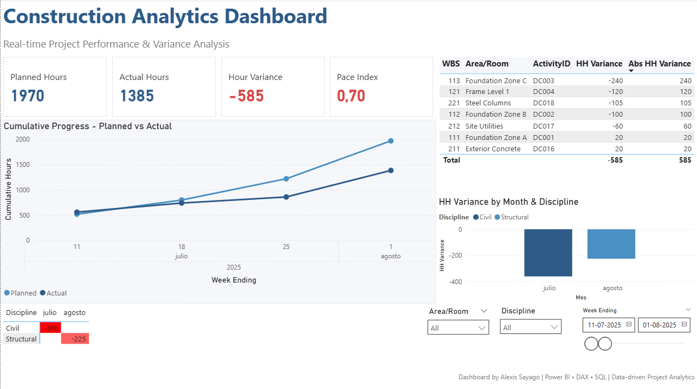

# P1 — Plan vs Actual Dashboard (Power BI)

**Goal.** Weekly view of *planned vs actual* work hours with variance and a simple **pace index** for engineering/construction projects.  
**Stack.** Power BI (DAX, modeling) · Power Query · CSV demo data (starter).  
**Deliverables.** `.pbix` + README + screenshots/PDF.

> This repo has two layers: **Starter** (ship fast) and **Advanced Appendix** (EVM/XER add-on).

---

## 0) Repository structure
```
p1-plan-vs-actual-powerbi/
├─ README.md
├─ p1.pbix                # (add when ready; keep out of Git or use LFS)
├─ /data
│  ├─ activities.csv              # sample or real data
│  └─ date.csv                    # weekly calendar (Sunday start, with FridayLabel)
├─ /assets
│  ├─ screenshot-01.png
│  ├─ screenshot-02.png
│  └─ report.pdf                  # optional, exported from PBIX
└─ /scripts (optional, advanced)
   └─ xer_to_csv/...              # Power Query / helpers for XER → CSV (appendix)
```

> Start with the **Starter** section below. Treat the **Appendix** as optional until the base is shipped.

---

## 1) Starter — minimal model (CSV)

### 1.1 Data schema

**`activities.csv` (fact, required fields)**  
- `ActivityID` (key), `WBS`, `Discipline`, `Area/Room`  
- `BaselineStart`, `BaselineFinish`, `ActualStart`, `ActualFinish` (ISO `YYYY-MM-DD`)  
- `PlannedHours`, `ActualHours`, `PercentComplete` (numbers)

**`date.csv` (DimDate, weekly)**  
- `Date` (Sunday for each week), `FridayLabel` (Date + 5), `Week`, `Year`

> Use `FridayLabel` on the X-axis to display "week ending Friday".

### 1.2 Data model (star)
- **FactActivities** ← `activities.csv`  
- **DimDate** ← `date.csv`  
- Optional dims from facts: **DimDiscipline**, **DimArea** (via reference tables)

**Relationships**  
- Create a weekly key or map activity dates to weeks. Simplest: link `FactActivities[BaselineStart]` to `DimDate[Date]` (or a derived WeekKey in both).

**Tip:** prefer a dedicated WeekKey instead of linking BaselineStart→Date.
- In `FactActivities`: WeekStart = STARTOFWEEK ( FactActivities[BaselineStart], SUNDAY )
- In `DimDate`: use `Date` as the Sunday of each week (already provided)
- Relate FactActivities[WeekStart] → DimDate[Date].

### 1.3 DAX measures (base)
```DAX
-- Hours
Total Planned HH = SUM ( FactActivities[PlannedHours] )
Total Actual HH  = SUM ( FactActivities[ActualHours] )
HH Variance      = [Total Actual HH] - [Total Planned HH]

-- Cumulative curves (S-curve)
Cum Planned HH =
CALCULATE(
    [Total Planned HH],
    FILTER ( ALL ( 'DimDate'[Date] ), 'DimDate'[Date] <= MAX ( 'DimDate'[Date] ) )
)

Cum Actual HH =
CALCULATE(
    [Total Actual HH],
    FILTER ( ALL ( 'DimDate'[Date] ), 'DimDate'[Date] <= MAX ( 'DimDate'[Date] ) )
)

-- Pace index (proxy of schedule performance based on hours)
Pace Index (SPI proxy) = DIVIDE ( [Cum Actual HH], [Cum Planned HH] )

-- Optional extras
HH Variance % = DIVIDE ( [HH Variance], [Total Planned HH] )

-- Slicer-aware S-curve (use when you want slicers to affect the cumulative window)
Cum Planned HH (Selected) =
CALCULATE(
    [Total Planned HH],
    FILTER(ALLSELECTED('DimDate'[Date]), 'DimDate'[Date] <= MAX('DimDate'[Date]))
)

Cum Actual HH (Selected) =
CALCULATE(
    [Total Actual HH],
    FILTER(ALLSELECTED('DimDate'[Date]), 'DimDate'[Date] <= MAX('DimDate'[Date]))
)
```

If you build `DimDate` inside Power BI, add:
```DAX
FridayLabel = 'DimDate'[Date] + 5
```

### 1.4 Visuals (suggested)

1. **KPIs**: Planned HH, Actual HH, Variance HH, Pace Index.
2. **S-curve**: `Cum Planned HH` vs `Cum Actual HH` over `DimDate[FridayLabel]`.
3. **Variance by discipline**: stacked/clustered weekly bars.
4. **Top 10 deviations**: table (WBS/Area/ActivityID).
5. **Heatmap**: Week × Discipline by `HH Variance`.

**Slicers**: `Discipline`, `Area/Room`, `WBS`, Week range.

## Screenshots

<p align="center">
  <br/>
  <em>Complete project visibility in one view</em>
</p>

<p align="center">
  <br/>
  <em>Root cause analysis through interactive filtering</em>
</p>

<p align="center">
  <br/>
  <em>Mobile-first analytics for field teams</em>
</p>


### 1.5 Quickstart (60 seconds)
1. Clone repo and open `p1.pbix`.
2. Get Data → Text/CSV → load `/data/activities.csv` and `/data/date.csv`.
3. Create measures from section 1.3 and build the 5 visuals. Export 2–3 screenshots to `/assets`.

### 1.6 How to use (starter)

1. Copy `/data/activities.csv` and `/data/date.csv` into the repo.
2. Create/open `p1.pbix` → **Get Data → Text/CSV** → load both files.
3. Build relationships (FactActivities → DimDate).
4. Add DAX measures and visuals.
5. Export **PDF** and screenshots to `/assets`.

**Optional — Generate `DimDate` with Power Query (M)**
```m
let
    StartDate = #date(2025, 7, 6),         // Sunday
    Weeks     = 26,                         // adjust
    Source    = List.Transform({0..Weeks-1}, each Date.AddWeeks(StartDate, _)),
    Tbl       = Table.FromList(Source, Splitter.SplitByNothing(), {"Date"}),
    AddWeek   = Table.AddColumn(Tbl, "Week", each Date.WeekOfYear([Date], Day.Sunday)),
    AddYear   = Table.AddColumn(AddWeek, "Year", each Date.Year([Date])),
    AddFri    = Table.AddColumn(AddYear, "FridayLabel", each Date.AddDays([Date], 5))
in
    AddFri
```

### Known limitations
- Demo data is small and weekly; daily granularity is out of scope for the Starter.
- Critical path / logic is not included (see Appendix or future roadmap).
- `.pbix` is not versioned in Git by default; use LFS if you need to.

---

## 2) Performance & quality tips

- Keep numeric columns as **Whole/Decimal Number**; parse dates as **Date**.
- Hide technical columns (keys) from report view.
- For slicer-aware S-curves, consider `ALLSELECTED` instead of `ALL`.
- Version the `.pbix` via exported **PBIT** + data folder (optional). Keep `*.pbix` out of Git or use LFS.

---

## 3) Screenshots / Report

Place exported PNGs in `/assets` and (optional) a `report.pdf`.

---

## Appendix — Advanced EVM / XER (optional add-on)

### A.1 Sources & mapping

If you export from **Primavera P6 (XER)** or similar, map fields to the starter schema.

**Example mapping (P6 → model)**

| P6 field                 | Model column      | Notes                   |
| ------------------------ | ----------------- | ----------------------- |
| `task_id`                | `ActivityID`      | unique                  |
| `wbs_id` / `wbs_name`    | `WBS`             | string                  |
| `discipline` (custom)    | `Discipline`      | if available            |
| `location` (custom)      | `Area/Room`       | if available            |
| `start_date` (baseline)  | `BaselineStart`   | ISO `YYYY-MM-DD`        |
| `finish_date` (baseline) | `BaselineFinish`  | ISO                     |
| `act_start_date`         | `ActualStart`     | ISO                     |
| `act_finish_date`        | `ActualFinish`    | ISO                     |
| `target_work_qty`        | `PlannedHours`    | planned labor qty/hours |
| `act_work_qty`           | `ActualHours`     | actual labor qty/hours  |
| `phys_complete_pct`      | `PercentComplete` | 0–100                   |

> Terminology: keep **Baseline** naming consistent (avoid mixing with "PlannedFinish" unless you define it as an alias of `BaselineFinish`).

### A.2 Status Date (no `TODAY()`)

Use a **Status Date** driven by the report context (or parameter), instead of `TODAY()`.

```DAX
Status Date := MAX ( 'DimDate'[Date] )  -- depends on current filter context
```

### A.3 EVM-style hours (rename to avoid $ confusion)

```DAX
-- Earned Hours (EV)
Earned Hours (EV) =
SUMX (
    FactActivities,
    FactActivities[PlannedHours] * DIVIDE ( FactActivities[PercentComplete], 100 )
)

-- Planned Hours to Status (PV)
Planned Hours to Status (PV) =
CALCULATE (
    SUM ( FactActivities[PlannedHours] ),
    FILTER ( ALL ( 'DimDate'[Date] ), 'DimDate'[Date] <= [Status Date] )
)

-- Actual Hours (AC)
Actual Hours (AC) = SUM ( FactActivities[ActualHours] )

-- Indices
SPI = DIVIDE ( [Earned Hours (EV)], [Planned Hours to Status (PV)] )
CPI = DIVIDE ( [Earned Hours (EV)], [Actual Hours (AC)] )
```

### A.4 Trend (4W MA)

**4-week moving average with DATESINPERIOD**
```DAX
SPI (4W MA) =
VAR d = [Status Date]
RETURN
AVERAGEX (
    DATESINPERIOD ( 'DimDate'[Date], d, -4, WEEK ),
    [SPI]
)
```

### A.5 Advanced pages

- **EVM Overview**: EV/PV/AC, SPI/CPI, trend lines (4W MA), variance by WBS.
- **Critical / Near-critical**: activities with high variance or late finishes.
- **What-if**: scenario slicers for %Complete adjustments (optional).

### A.6 Scripts & conversions

If you include XER processing, add under `/scripts/xer_to_csv` a short guide or `.pq` file (Power Query) explaining the conversion to the starter schema.

---

## License

MIT License

Copyright (c) 2025 Alexis Sayago

Permission is hereby granted, free of charge, to any person obtaining a copy

---

## Changelog / Roadmap (optional)

- v0.1 — Starter (CSV) model & measures
- v0.2 — Appendix: EVM hours, SPI/CPI, 4W MA, XER mapping
